#  Práctica 2.4 – Balanceo de carga con proxy inverso en Nginx 

## IPs
Para esta práctica las IPs de mis servidores han sido:

- ip webserver1 192.168.43.47
- ip webserver2 192.168.43.46
- ip proxy 192.168.43.101

## Configuración de los webservers

Para ello primero debemos que cambiar el nombre de webserver por webserver1 en todos los sitios que aparezca. Para ello primer eliminamos el enlace simbólico en el servidor 1:

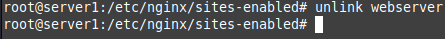

Cambiamos el nombre de la carpeta del servidor y creamos la ruta /var/www/webserver1/html . Ahora esta será la ruta de nuestra pagina web

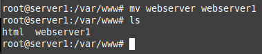

Ahora debemos quitar la página web que descargamos en la práctica anterior
y remplazarlo por el siguiente html:

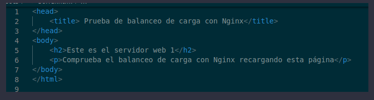

Que para el server 1 quedaría:

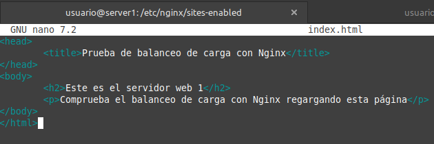

Cambiamos el nombre a los archivos de configuración:

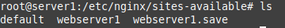

Ahora el paso más importante, el archivo de configuración. Solo tenemos que cambiar el nombre del servidor y de la cabecera a webserver1 y Serv_Web1_salva para la cabecera:

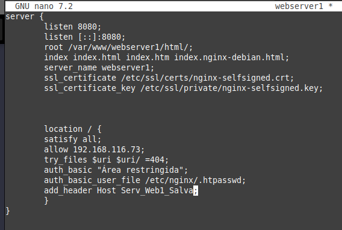

Por último volvemos a crear el enlace simbólico:

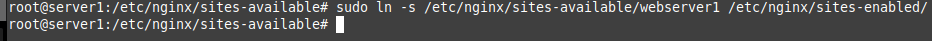

Reiniciamos el servicio y ahora debemos de clonar el webserver que acabamos de hacer pero eligiendo la opción de virtual box que nos da una nueva dirección MAC. Esto es para que el router le asigne una nueva IP. 

Repetimos todo el proceso de la misma forma:

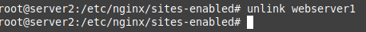

Creamos el html con el nombre bien puesto:

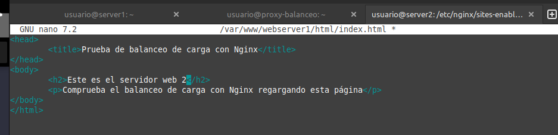

Cambiamos nombre

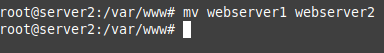

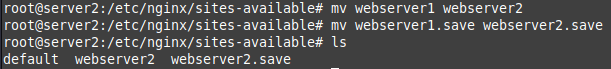

Una vez hecho volvemos a crear el enlace simbólico

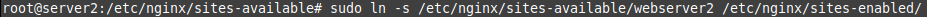

Ahora debemos de cambiar el archivo de configuración de la misma forma:


## Configuración del balanceador de carga

Ahora debemos de cambiar el nombre de lso archivos de configuración por balanceo

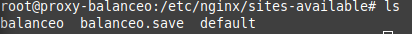

Ahora el paso clave. Debemos de cambiar el archivo de configuración para que el proxy-balanceador de carga redirija el tráfico a los dos servidores. Para ello debemos cambiar el archivo para que tenga este formato:

```
 upstream backend_hosts {
                random;
                server ________:____;
                server ________:____;
    }
            server {
                listen 80;
                server_name ________;      
                location / {
                    proxy_pass http://backend_hosts;
                }
            }
```

El bloque de server se encarga de redirigir el tráfico a los backend_hosts. Estos son el grupo de servidores definidos arriba en el bloque de upstream. Este bloque se encarga de la redirección y de que patrón seguir, en nuestro caso random para mayor simplicidad. Ahí añadiremos los servidores, donde la primera raya es donde tiene que estar la ip del servidor y en la siguiente raya después de los dos puntos el puerto que escucha el servidor. 

El archivo de configuración en mi caso quedó:

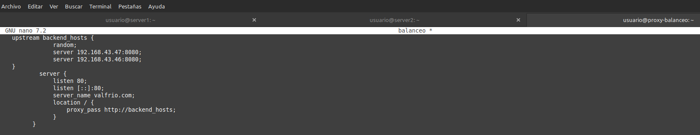

Ahora entramos para comprobar que funciona


Podemos ver que nos ha servido el primer servidor. Si recargamos las suficientes veces veremos que nos servirá el segundo servidor


Podemos ver los logs de acceso para mayor seguridad:

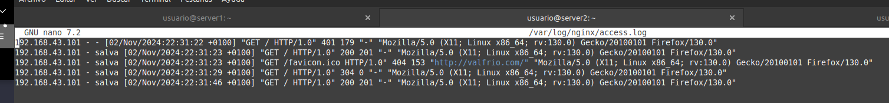

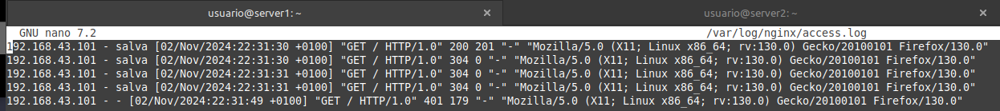

Ahora veremos que el balanceador comprueba que los servicios estén activos a la hora de redirigir. Pararemos el servicio en ambas máquinas y veremos que efectivamente redirige a la otra todo el rato. Comenzamos con el primer servidor:

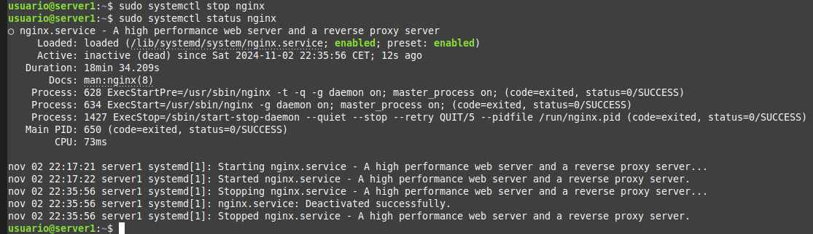

Efectivamente me redirigió solo al servidor 2.


Iniciamos de nuevo el servicio

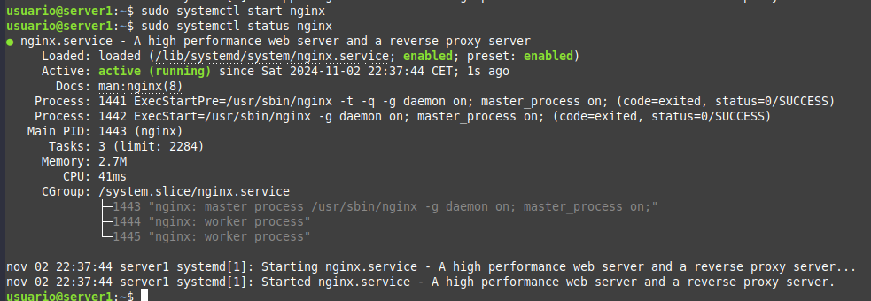

Y hacemos lo mismo con el webserver2

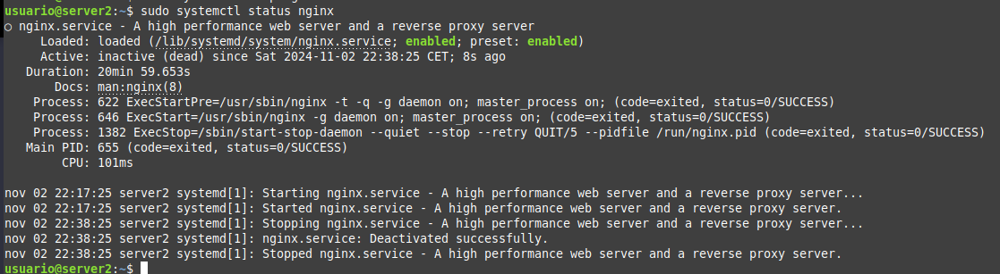


## Cuestiones finales

### Cuestión 1

Los siguientes métodos encontrados son los más comunes que he visto:

- Round Robin: Asigna solicitudes secuencialmente entre los servidores.

- Least Connections: Envía la solicitud al servidor con menos conexiones activas.

- IP Hash: Utiliza la IP del cliente para definir siempre el mismo servidor en función de su dirección

### Cuestión 2


El bloque de server se encarga de redirigir el tráfico a los backend_hosts. Estos son el grupo de servidores definidos arriba en el bloque de upstream. Este bloque se encarga de la redirección y de que patrón seguir. Ahí añadiremos los servidores, donde la primera raya es donde tiene que estar la ip del servidor y en la siguiente raya después de los dos puntos el puerto que escucha el servidor. 

### Cuestión 3

Deberíamos seguir dos pasos:

- Definir el bloque upstream  para añadir la ip y los puertos de las peticiones, así añadiendo la función de balanceador.

- Definir en el bloque location el proxy_pass que redirija las peticiones a los servidores definidos en el upstream.