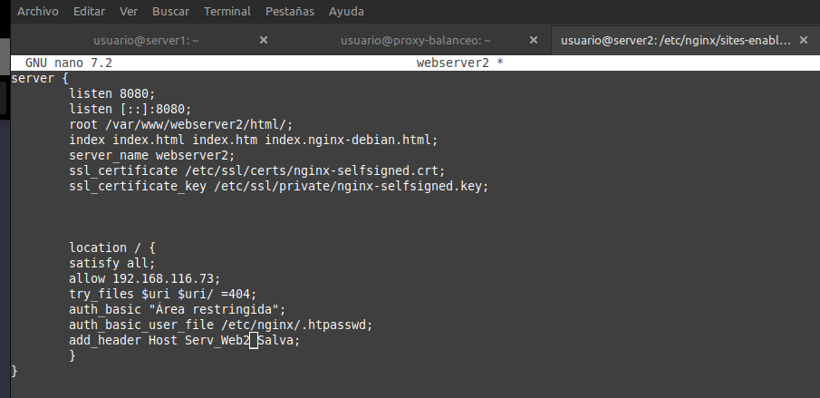

#  Práctica 2.4 – Balanceo de carga con proxy inverso en Nginx 

## IPs
Para esta práctica las IPs de mis servidores han sido:

- ip webserver1 192.168.43.47
- ip webserver2 192.168.43.46
- ip proxy 192.168.43.101

## Configuración de los webservers

Para ello primero debemos que cambiar el nombre de webserver por webserver1 en todos los sitios que aparezca. Para ello primer eliminamos el enlace simbólico en el servidor 1:

Cambiamos el nombre de la carpeta del servidor y creamos la ruta /var/www/webserver1/html . Ahora esta será la ruta de nuestra pagina web

Ahora debemos quitar la página web que descargamos en la práctica anterior
y remplazarlo por el siguiente html:

Que para el server 1 quedaría:

Cambiamos el nombre a los archivos de configuración:

Ahora el paso más importante, el archivo de configuración. Solo tenemos que cambiar el nombre del servidor y de la cabecera a webserver1 y Serv_Web1_salva para la cabecera:

Por último volvemos a crear el enlace simbólico:

Reiniciamos el servicio y ahora debemos de clonar el webserver que acabamos de hacer pero eligiendo la opción de virtual box que nos da una nueva dirección MAC. Esto es para que el router le asigne una nueva IP. 

Repetimos todo el proceso de la misma forma:

Creamos el html con el nombre bien puesto:

Cambiamos nombre

Una vez hecho volvemos a crear el enlace simbólico

Ahora debemos de cambiar el archivo de configuración de la misma forma:

## Configuración del balanceador de carga

## Cuestiones finales